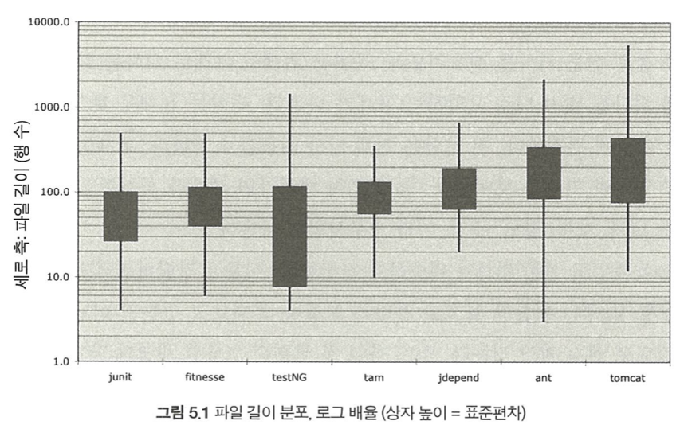
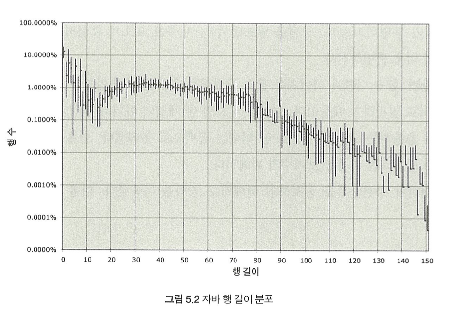

로버틴 C. 마틴의 "Clean Code"를 읽으며 쓰는 중입니다.

## 1장 깨끗한 코드

**르블랑의 법칙**(Leblanc's law): 나중은 결코 오지 않는다.

나쁜 코드가 쌓일수록 팀 생산성은 떨어진다.

## 2장 의미 있는 이름

### 의도를 분명히 밝혀라

코드의 맥락이 코드 자체에 명시적으로 드러나도록 작성한다.

### 그릇된 정보를 피하라

```java
int a = l;
if (O == l)
a = O1;
else
l = 01;
```

다음의 예시에서 0과 O, 1과 l은 매우 혼동하기 쉽다.

### 의미 있게 구분하라

```java
getActiveAccount();
getActiveAccounts();
getActiveAccountInfo();
```

세 개의 함수 모두 구분이 가지 않는다.

### 검색하기 쉬운 이름을 사용하라

`MAX_CLASSES_PER_STUDENT`는 찾기 쉽지만, 숫자 7은 은근히 까다롭다. 파일 이름이나 수식이 모두 검색되기 때문이다.

**이름 길이는 범위 크기에 비례해야 한다.**

### 클래스와 매서드 이름

클래스와 객체 이름은 명사나 명사구가 적합하다.

ex) Customer, WikiPage, Account

매서드 이름은 동사나 동사구가 적합하다.

ex) postPayment, deletePage, save

접근자(Accessor), 변경자(Mutator), 조건자(Predicate)는 javabean 표준에 따르면 값 앞에 get, set, is를 각각 붙인다.

### 한 개념에 한 단어를 사용하라

동일 코드 기반에 controller, manager, driver를 섞어쓰면 혼란스럽다.

### 의미 있는 맥락을 추가하라

firstName, street, houseNumeber, city, state, zipcode의 변수를 훑어보면 주소를 금방 알아채나, state 단 하나만 보았을 때에는 그렇지 못하다. addr라는 접두어를 추가해 addrFirstName, addrLastName, addrState라 쓰면 맥락이 더 분명해진다. 

## 3장 함수

### 작게 만들어라!

*블록과 들여쓰기*

위의 말에 따르면 결국 if/else/while에 들어가는 블록은 한 줄이어야 한다는 의미이다. 이 말은 다시 중첩 구좌 생길만큼 함수가 커져서는 안 된다는 의미이다. 함수에서 들여쓰기 수준은 1단이나 2단을 넘어서면 안 된다.

### 한 가지만 해라!

**함수는 한 가지를 해야 한다. 그 한 가지를 잘 해야 한다. 그 한 가지만을 해야 한다.**

매우 인상 깊은 구절이다. 결국 함수는 한 가지보다 더 많은 일을 해서는 안 되며, 그 한 가지조차도 잘해야 한다는 것이다.

### 함수당 추상화 수준은 하나로!

`getHtml()`은 추상화 수준이 아주 높은 반면, `String pathPathName = PathParser.render(pagePath);`는 추상화 수준이 중간이다. 그리고 `.append("\n")`와 같은 코드는 아주 낮다. 한 함수 내에서 추상화 수준은 같아야 한다.

*위에서 아래로 코드 읽기: 내려가기 규칙*

코드는 위에서 아래로 이야기처럼 읽혀야 좋다. 위에서 아래로 프로그램을 읽으면 함수 추상화 수준이 한 번에 한 단계씩 낮아진다.

### Switch 문

Switch 문은 작게 만들기 어렵다. 본질적으로 Switch 문은 N가지를 처리하며, 완전히 피할 방법은 없다.

```java
public Money calculatePay(Employee e) throws InvalidEmployeeType{
    switch (e.type){
        case COMMISSIONED:
            return calculateCommissionedPay(e);
        case HOURLY:
            return calculateHourlyPay(e);
        case SALARIED:
            return calculateSalariedPay(e);
        default:
            throw new InvalidEmployeeType(e.type);
    }
}
```

위 함수에는 몇 가지 문제가 있다.

+ 함수가 길다. 새 직원 유형을 추가하면 더 길어진다.

+ '한 가지' 작업만 수행하지 않는다.

+ SRP(Single Responsibility Principle)를 위반한다. 코드를 변경할 이유가 여럿이다.

+ OCP(Open Closed Principle)를 위반한다. 새 직원 유형을 추가할 때마다 코드를 변경하기 때문이다.


하지만, 가장 심각한 문제는 위 함수와 구조가 동일한 함수가 무한정 존재한다는 점이라고 한다.
`isPayday(Employee e, Date date)` 혹은 `deliverPay(Employee e, Money Pay)` 등 가능성은 무한하다.

```java
public abstract class Employee{
    public abstract boolean isPayday();
    public abstract Money calculatePay();
    public abstract void deliverPay(Money Pay);
}

public interface EmployeeFactory{
    public Employee makeEmployee(EmployeeRecore r) throws InvalidEmployeeType;
}

public class EmployeeFactoryImpl implements EmployeeFactory {
    public Employee makeEmployee(EmployeeRecord r) throws InvalidEmployeeType {
        switch (r.type){
            case COMMISSIONED:
            return new ComissionedEmployee(r);
        case HOURLY:
            return new HourlyEmployee(r);
        case SALARIED:
            return new SalariedEmployee(r);
        default:
            throw new InvalidEmployeeType(r.type);
        }
    }
}
```

위의 코드가 문제를 해결한 코드이다. switch문을 abstract factory에 숨긴다. factory는 switch 문을 사용해 적절한 Employee 파생 클래스의 인스턴스를 생성한다. calculatePay, isPayday, deliverPay 등과 같은 함수는 Employee 인터페이스를 거쳐 호출된다. 그러면 다형성으로 인해 실제 파생 클래스의 함수가 실행된다.

#### Single Responsibility Principle(단일 책임 원칙)

정의

+ 하나의 클래스는 오직 하나의 책임만 가져야 하며, 변경 사유가 하나여야 한다.

+ 즉, 클래스는 특정 기능이나 목적에 집중해야 하며, 여러 가지 역할을 동시에 수행하지 않아야 한다.

목적

+ 코드의 응집도를 높이고, 결합도를 낮춰 유지보수를 용이하게 한다.

+ 변경이 필요한 경우, 다른 부분에 영향을 주지 않도록 설계한다.

예시

SCP 위반 예제:

```java
class User {
    public void login() {
        // 로그인 로직
    }

    public void save() {
        // 데이터베이스 저장 로직
    }
}
```

SCP를 준수한 예제:

```java
class User {
    // 사용자 관련 데이터만 관리
}

class UserService {
    public void login(User user) {
        // 로그인 로직
    }
}

class UserRepository {
    public void save(User user) {
        // 데이터베이스 저장 로직
    }
}
```

+ 'User', 'UserService', 'UserRepository'로 역할을 분리하여 각 클래스가 단일 책임만 가지게 된다.

#### Open Closed Principle(개방 폐쇄 원칙)

정의

+ 소프트웨어 엔티티(클래스, 모듈, 함수 등)는 확장에는 열려(Open) 있어야 하고, 수정에는 닫혀(Close) 있어야 한다.

+ 즉, 새로운 기능을 추가할 때 기존 코드를 수정하지 않고 확장할 수 있어야 한다.

목적

+ 기존 코드에 영향을 주지 않고 새로운 요구사항을 반영할 수 있도록 설계한다.

+ 코드 변경으로 인한 부작용을 최소화하고, 시스템 안정성을 높인다.

적용 방법

1. 상속: 부모 클래스를 확장하여 새로운 기능을 추가.

2. 인터페이스와 다형성: 인터페이스를 정의하고 이를 구현하는 방식으로 확장성을 확보.

예시

OCP 위반 예제:

```java
public class Driver {
    public void drive(String carType) {
        if (carType.equals("Sonata")) {
            System.out.println("나는 소나타를 운전한다.");
        } else if (carType.equals("Grandeur")) {
            System.out.println("나는 그랜저를 운전한다.");
        }
    }
}
```

+ 새로운 자동차 종류가 추가될 때마다 drive 메서드를 수정해야 하므로 OCP를 위반한다.

OCP를 준수한 예제:

```java
abstract class Car {
    abstract void drive();
}

class Sonata extends Car {
    @Override
    void drive() {
        System.out.println("나는 소나타를 운전한다.");
    }
}

class Grandeur extends Car {
    @Override
    void drive() {
        System.out.println("나는 그랜저를 운전한다.");
    }
}

public class Driver {
    public static void main(String[] args) {
        Car[] cars = {new Sonata(), new Grandeur()};
        for (Car car : cars) {
            car.drive();
        }
    }
}
```

+ 새로운 자동차 클래스를 추가하더라도 기존 코드는 수정되지 않으며, 확장만 하면 된다.

### 함수 인수

함수에서 이상적인 인수 개수는 0개이다. 다음은 1개이며 다음은 2개이다. 3개는 가능한 피하는 편이 좋으며 4개 이상은 특별한 이유가 필요하다.

#### 많이 쓰는 단항 형식

함수에 인수 1개를 넘기는 이유는 흔히 2가지라고 한다.

하나는 인수에 질문을 던지는 경우다. `boolean fileExists("MyFile")`이 좋은 예시다. 

다른 하나는 인수를 뭔가로 변환해 결과를 반환하는 경우다. `InputStream fileOpen("MyFile")`은 String 형의 파일 이름을 InputStream으로 변환한다. 

다소 드물지만 아주 유용한 단항 함수 형식이 이벤트다. 이벤트 함수는 입력 인수만 있으며 출력 인수는 없다. `passwordAttemptFailedNtimes(int attempts)`가 좋은 예다.

위의 경우들이 아니라면 단항은 가급적 피해야 한다. 예를 들어, `void includeSetupPageInfo(StringBuffer pageText)`는 피한다. 변환 함수에서 출력 인수(reference, pointer)를 사용하면 혼란을 일으킨다. 입력 인수를 변환하는 함수라면 변환 결과는 반환값으로 돌려준다. `StringBuffer transform(StringBuffer in)`이 `void transform(StringBuffer out)`보다 좋다. 

#### 플래그 인수

지양해야 한다. `render(true)`는 정말 아닌 듯 하다. `render(boolean isSuite)`는 `renderForSuite()`와 `renderforSingleTest`라는 함수로 나누어야 마땅하다.

#### 이항 함수

인수가 2개인 함수는 인수 1개인 함수보다 이해하기 어렵다. 이항 함수가 적절한 경우도 있는데, `Point p = new Point(0, 0)`이 좋은 예시다.

아주 당연하게 여겨지는 이항 함수 `asserEquals(expected, actual)`도 문제가 있다. 두 인수 사이에는 자연적인 순서가 없으며, 코딩 중에 순서가 뒤바뀌는 실수를 저지를 수 있다.

이항 함수가 무조건 나쁘다는 소리는 아니며, 불가피한 경우도 있다. 하지만 그만큼 위험이 따른다는 사실은 인지해야 한다.

삼항 함수도 마찬가지로 신중히 고려해야 한다.

#### 인수 객체

인수가 2~3개 필요하면 일부를 독자적인 클래스 변수로 선언할 가능성을 짚어본다.

```java
Circle makeCircle(double x, double y, double radius);
Circle makeCircle(Point center, double radius);
```

#### 인수 목록

때로는 인수 개수가 가변적인 함수도 필요하다.

```java
public String Format(String format, Object... args)

String.format("%s worked %.2f hours.", name, hours);
```

위 예제처럼 가변 인수 전부를 동등하게 취급하면 List 형 인수 하나로 취급할 수 있다. 이런 논리로 보면 `String.format`은 사실상 이항 함수이며, 실제로도 이항함수이다.

#### 동사와 키워드

단항 함수는 함수와 인수가 동사/명사 쌍을 이뤄야 한다. `write(name)`이 좋은 예시다.

함수 이름에 인수 이름을 넣는다. `assertEquals`보다 `assertExpectedEqualsAcutal(expected, actual)`이 더 좋다. 이렇게 하면 인수 순서를 기억할 필요가 없다.

### 부수 효과를 일으키지 마라!

부수효과는 거짓말이다. 함수에서 한 가지를 하겠다고 약속하고선 남몰래 다른 짓도 한다. 때로는 예상치 못하게 클래스 변수를 수정하고 때로는 함수로 넘어온 인수나 시스템 전역 변수를 수정한다. 많은 경우 시간적인 결합(temporal coupling)이나 순서 종속성(order dependency)를 초래한다.

### 명령과 조회를 분리하라!

단순하게 get과 set은 한 함수 내에서 이루어지면 안 된다.

### 오류 코드보다 예외를 사용하라!

명령 하수에서 오류 코드를 반환하는 방식은 명령/조회 분리 규칙을 미묘하게 위반한다. 자칫하면 if 문에서 명령을 표현식으로 쓰기 쉽다.

```java
if(deletePage(page)  == E_OK)
```

위 코드는 동사/형용사 혼란을 일으키지 않는 대신 여러 단계로 중첩되는 코드를 야기한다.

오류 코드 대신 에외(try catch 문)를 사용하면 오류 처리 코드가 원래 코드에서 분리되므로 깔끔해진다.

#### Try/Catch 블록 뽑아내기

try/catch 블록은 원래 추하다. 코드 구조에 혼란을 일으키며, 정상 동작과 오류 처리 동작을 뒤섞는다. 그러므로 try/catch 블록을 별도 함수로 뽑아내는 편이 좋다.

#### 오류 처리도 한 가지 작업이다.

함수와 마찬가지로 오류 처리도 '한 가지' 작업에 속한다. 즉, 오류를 처리하는 함수는 오류만을 처리해야 한다.

### 반복하지 마라!

당연하게도 중복은 소프트웨어에서 모든 악의 근원이다.

구조적 프로그래밍(Structured Programming), AOP(Aspect Oriented Programming), COP(Component Oriented Programming) 모두 어떤 면에서 중복 제거 전략이다.

#### 구조적 프르그래밍(Structured Programming)

정의

+ 구조적 프로그래밍은 프로그램의 제어 흐름을 순차, 선택(조건문), 반복(루프)이라는 세 가지 기본 구조로 제한하여 논리적으로 체계적인 코드를 작성하는 프로그래밍 방법론입니다.

+ 1960년대에 **에츠허르 데이크스트라(Edsger Dijkstra)**가 제안한 개념으로, 복잡한 프로그램을 단순하고 읽기 쉽게 만드는 데 초점을 둡니다.

특징

1. 제어 구조:

    + 순차 실행: 코드가 위에서 아래로 순서대로 실행.

    + 선택 구조: 조건문(예: `if`, `switch`)을 통해 분기.

    + 반복 구조: 루프(예: `for`, `while`)를 통해 반복 실행.

2. 모듈화: 프로그램을 작은 모듈로 나누어 각 모듈이 특정 기능만 수행하도록 설계.

3. `goto` 사용 금지: 제어 흐름을 복잡하게 만드는 `goto` 문을 배제하여 코드 가독성과 유지보수성을 높임.

장점

+ 코드의 가독성과 유지보수성이 향상됨.

+ 오류를 줄이고 디버깅이 용이함.

예시

```java
public int factorial(int n) {
    int result = 1;
    for (int i = 1; i <= n; i++) {
        result *= i;
    }
    return result;
}
```

#### Aspect-Oriented Programming

정의

+ **AOP(관점 지향 프로그래밍)**은 핵심 비즈니스 로직과 부가적인 기능(예: 로깅, 보안, 트랜잭션 관리 등)을 분리하여 모듈화하는 프로그래밍 패러다임입니다.

+ 핵심 로직에 영향을 주지 않고도 공통적인 기능을 추가하거나 관리할 수 있도록 설계됩니다.

핵심 개념

1. 횡단 관심사(Cross-Cutting Concerns): 여러 모듈에 걸쳐 공통적으로 적용되는 기능(예: 로깅, 인증).

2. 애스펙트(Aspect): 횡단 관심사를 캡슐화한 모듈.

3. 포인트컷(Pointcut): 애스펙트를 적용할 코드 지점을 정의.

4. 어드바이스(Advice): 포인트컷에서 실행될 구체적인 코드(예: 메서드 실행 전/후 로직).

장점

+ 코드 중복 제거 및 유지보수성 향상.

+ 핵심 비즈니스 로직과 부가 기능 간의 명확한 분리.

예시

```java
@Aspect
@Component
public class LoggingAspect {

    @Before("execution(* com.example.service.*.*(..))")
    public void logBeforeMethodExecution() {
        System.out.println("Method execution started.");
    }
}
```

+ 위 예제는 특정 패키지 내 메서드 실행 전에 로그를 출력하는 AOP 구현입니다.

#### Component-Oriented Programming

정의

+ **COP(컴포넌트 지향 프로그래밍)**은 재사용 가능한 컴포넌트를 조립하여 애플리케이션을 개발하는 방식입니다.

+ 컴포넌트는 독립적으로 개발되고 배포 가능한 소프트웨어 단위로, 특정 기능을 수행하며 명확한 인터페이스를 제공합니다.

특징

1. 재사용성: 컴포넌트는 독립적으로 설계되어 다른 애플리케이션에서도 재사용 가능.

2. 모듈화: 애플리케이션은 여러 컴포넌트를 조합하여 구성됨.

3. 캡슐화: 컴포넌트 내부 구현은 외부에서 볼 수 없으며, 인터페이스를 통해서만 접근 가능.

장점

+ 개발 속도 향상: 기존 컴포넌트를 조합하여 빠르게 애플리케이션 개발 가능.

+ 유지보수성: 컴포넌트를 독립적으로 수정 가능.

+ 확장성: 새로운 컴포넌트를 추가하여 기능 확장이 용이.

예제(React 컴포넌트 기반 개발)

```javascript
function Header() {
    return (
        <header>
            <h1>Welcome to My App</h1>
        </header>
    );
}

function App() {
    return (
        <div>
            <Header />
            <p>This is the main content.</p>
        </div>
    );
}
```

+ 위 예제는 React에서 `Header`와 `App`이라는 두 개의 독립적인 컴포넌트를 조합하여 애플리케이션을 구성한 사례입니다.

## 4장 주석

> 나쁜 코드에 주석을 달지 마라. 새로 짜라. (브라이언 W. 커니핸, P.J. 플라우거)

이 책의 저자는 주석을 매우 혐오한다. 오히려 주석을 남길 바에는 차라리 코드를 확실하게 작성하여 주석을 줄이는 방향으로 가야 한다고 주장하고 있다. 코드를 수정할 때와 마찬가지로 주석 또한 코드가 수정되면 수정되어야 하는데 그렇지 않은 경우 더 안 좋은 쪽으로 변한다.

### 코드로 의도를 표현하라!

```java
// 직원에게 복지 혜택을 받을 자격이 있는지 검사한다.
if ((employee.flags & HOURLY_FLAG) && (employee.age > 65))

if(employee.isEligibleForFUllBenefits())
```

### 좋은 주석

#### 법적인 주석

때로는 회사가 정립한 구현 표준에 맞춰 특정 주석을 넣으라고 명시한다. 예를 들어, 각 소스 파일 첫머리에 주석으로 들어가는 저작권 정보와 소유권 정보는 필요하고도 타당하다.

다만, 모든 조항과 조건을 열거하는 대신에, 가능하다면, 표준 라이선스나 외부 문서를 참조하는 것이 좋다.

#### 정보를 제공하는 주석

```java
// 테스트 중인 Responder 인스턴스를 반환한다.
protected abstract Responder responderInstance();
```

좋은 주석이나 가능하면 함수이름에 정보를 담아두는 편이 더 좋다.

```java
// kk:mm:ss EEE, MMM dd, yyyy 형식이다.
Pattern timeMatcher = Pattern.compile(
    "\\d*:\\d*:\\d* \\w*, \\w* \\d*, \\d*");
```

더 개선하면 시간과 날짜를 변환하는 클래스를 만들어 코드를 옮겨주면 더 좋고 더 깔끔해진다.

#### 의도를 설명하는 주석

#### 의미를 명료하게 밝히는 주석

인수나 반환값이 표준 라이브러리나 변경하지 못하는 코드에 속한다면 의미를 명료하게 밝히는 주석이 유용하다.

```java
assertTrue(a.compareTo(a) == 0); // a == a
assertTrue(a.compareTo(b) != 0); // a != b
aseertTrue(a.compareTo(b) == -1); // a < b
```

그릇된 주석을 달아놓을 위험도 항상 있다. 그래서 위와 같은 주석을 달 때에는 더 나은 방법이 없는지 고민하고 정확히 달도록 각별히 주의한다.

#### 결과를 경고하는 주석

```java
// 여유 시간이 충분하지 않다면 실행하지 마십시오.
public void _testWithReallyBigFile(){}
```

#### TODO 주석

때로는 '앞으로 할 일'을 `//TODO` 주석으로 남겨두면 편하다. TODO 주석은 프로그래머가 필요하다 여기지만 당장 구현하기 어려운 업무를 기술한다. 

### 나쁜 주석

+ 주절거리는 주석: 특별한 이유없이 의무감으로 혹은 프로세스에서 하라고 하니까 마지못해 주석을 단다면 전적으로 시간낭비다.

+ 같은 이야기를 중복하는 주석

+ 오해할 여지가 있는 주석

+ 의무적으로 다는 주석(ex: 모든 함수에 다는 Javadocs)

+ 위치를 표현하는 주석(ex: `// Actions ///////////////////////`)

+ 닫는 괄호에 다는 주석

+ 주석으로 처리하는 코드: Terrible

+ 모호한 관계: 주석을 다는 목적은 코드만으로 설명이 부족해서다. 주석 자체가 다시 설명을 요구하면 그건..

## 5장 형식 맞추기

코드 형식은 의사소통의 일환이다.

### 적절한 행 길이를 유지하라.



#### 신문 기사처럼 작성하라.

#### 개념은 빈 행으로 분리하라.

코드의 가독성을 위해 빈 행은 필수적이다.

#### 세로 밀집도

줄 바꿈이 개념을 분리하다면 세로 밀집성은 연관성을 의미한다. 즉, 서로 밀집한 코드 행은 세로로 가까이 놓여야 한다는 뜻이다.

#### 수직 거리

서로 밀접한 개념은 세로로 가까이 둬야 한다.

+ 변수 선언: 변수는 사용하는 위치에 최대한 가까이 선언한다. 

+ 인스턴스 변수: 인스턴스 변수는 클래스 맨 처음에 선언한다. 변수 간에 세로로 거리를 두지 않는다. C++, JAVA에서 각각 인스턴스 변수 선언 위치는 다르나, 잘 알려진 위치에 인스턴스 변수를 모은다는 사실이 중요하다.

+ 종속 함수: 한 함수가 다른 함수를 호출한다면 두 함수는 세로로 가까이 배치한다. 또한 가능하다면 호출하는 함수를 호출되는 함수보다 먼저 배치한다.

+ 개념적 유사성: 비슷한 동작을 수행하는 일군의 함수가 좋은 예시다.

#### 가로 형식 맞추기



프로그래머는 명백히 짧은 행을 선호한다.

#### 가로 공백과 밀집도

```java
int lineSize = line.length();
totalChars += lineSize;
lineWidthHistogram.addline(lineSize, lineCount);
```

할당 연산자를 강조하려고 앞뒤에 공백을 줬다. 할당문은 왼쪽 요소와 오른쪽 요소가 분명히 나뉜다.

반면, 함수 이름과 이어지는 괄호 사이에는 공백을 넣지 않았다. 함수와 인수는 서로 밀접하기 때문이다.

#### 들여쓰기

이 들여쓰기는 너무나도 중요하다.

#### 들여쓰기 무시하기

간단한 if 문, while 문, 짧은 함수에서 들여쓰기 규칙을 무시하고픈 유혹이 생기더라도 다시 돌아가 들여쓰기를 넣는다.

### 팀 규칙

프로그래머라면 각자 선호하는 규칙이 있다. 하지만 팀에 속한다면 자신이 선호해야 할 규칙은 바로 팀 규칙이다.


