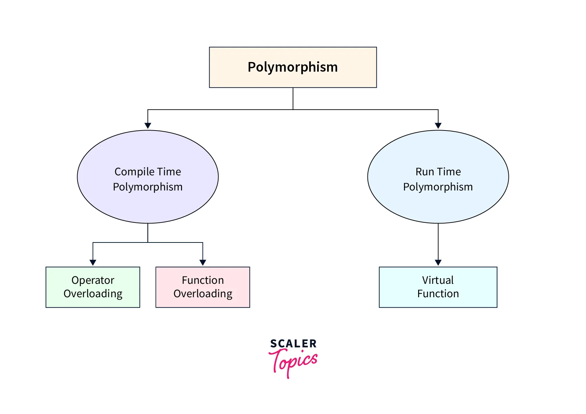

클린 코드를 읽으면서 객체 지향에 대한 공부를 개인적으로 더 할 필요가 있다고 생각해 기록하려고 한다.

## 프로그래밍 패러다임


객체 지향 프로그래밍은 프로그램 설계 방법론의 일종으로 명령형 프로그래밍에 속한다.

## 객체 지향의 주요 5가지 요소


봄 학기에 들었던 수업 중에 필기한 것이다. 그때 뭔가 중요하다 생각되어서 필기해 놓았는데 자세히 살펴보자.

### 1. Encapsulation

캡슐화는 어딜가나 언급되는 중요한 개념이다. 크게 2가지 측면이 있다.

1. 객체의 속성(data fields)과 행위(methods)를 하나로 묶고,

2. 실제 구현 내용 일부를 내부에 감추어 은닉한다.

이를 통해 데이터 무결성(의도하지 않은 요인에 의해 데이터, 소프트웨어, 시스템 등이 변경되거나 손상되지 않고 완전성, 정확성, 일관성을 유지하는 특성)을 유지하고 코드의 모듈화를 촉진한다.

예제:

```java
class Person {
    private String name; // 캡슐화된 데이터
    public String getName() { return name; }
    public void setName(String name) { this.name = name; }
}
```

### 2. Subtyping

> 서브타이핑은 한 클래스가 다른 클래스의 하위 타입(subtype)이 되는 관계를 의미한다.

이 말만 보아서는 상속(inheritance)과 개념이 매우 혼동된다. 

#### Subtyping vs Inheritance

##### Subtyping이란?

`Subtyping`은 `Type` 간의 관계를 정의하며, 한 타입이 다른 타입을 대체할 수 있는지 여부를 결정한다.
이는 LSP에 기반해 프로그램에서 상위 타입(Supertype)이 기대되는 곳에 하위 타입(Subtype)을 사용할 수 있어야 한다는 규칙을 따른다.

핵심 특징

+ 서브타이핑은 인터페이스 기반입니다. 즉, 하위 타입은 상위 타입의 모든 동작(메서드와 속성)을 지원해야 합니다.

+ 서브타입은 상위 타입의 계약(contract)을 준수해야 하며, 이를 통해 다형성(polymorphism)을 가능하게 합니다.

+ 서브타이핑은 반드시 상속을 필요로 하지 않습니다. 예를 들어, Java에서는 인터페이스 구현을 통해 서브타이핑 관계를 정의할 수 있습니다.

예제

```java
// 상위 타입 정의
interface Bird {
    void eat();
}

// 하위 타입 1: 참새
class Sparrow implements Bird {
    @Override
    public void eat() {
        System.out.println("Sparrow is eating.");
    }
}

// 하위 타입 2: 펭귄
class Penguin implements Bird {
    @Override
    public void eat() {
        System.out.println("Penguin is eating.");
    }
}

// 테스트 코드
public class Main {
    public static void main(String[] args) {
        Bird bird1 = new Sparrow();
        Bird bird2 = new Penguin();

        bird1.eat(); // 출력: Sparrow is eating.
        bird2.eat(); // 출력: Penguin is eating.
    }
}
```

##### Inheritance

상속은 구현 재사용을 목적으로 하며, 기존 클래스(슈퍼클래스)의 속성과 메서드를 새로운 클래스(서브클래스)로 전달하는 메커니즘입니다.

핵심 특징

+ 상속은 주로 코드 재사용(reuse)과 클래스 간 관계(structure)를 정의하기 위해 사용됩니다.

+ 서브클래스는 슈퍼클래스의 모든 속성과 메서드를 물려받으며, 이를 수정(오버라이딩)하거나 새로운 기능을 추가할 수 있습니다.

+ 상속은 반드시 서브타이핑을 보장하지 않습니다. 예를 들어, 상속된 메서드가 원래의 계약을 위반하면 서브타이핑 관계가 성립하지 않을 수 있습니다.

```java
// 상위 클래스: 직사각형
class Rectangle {
    private int width;
    private int height;

    public void setWidth(int width) {
        this.width = width;
    }

    public void setHeight(int height) {
        this.height = height;
    }

    public int getWidth() {
        return width;
    }

    public int getHeight() {
        return height;
    }

    public int area() {
        return width * height;
    }
}

// 하위 클래스: 정사각형
class Square extends Rectangle {
    @Override
    public void setWidth(int width) {
        super.setWidth(width);
        super.setHeight(width); // 정사각형은 너비와 높이가 같아야 함
    }

    @Override
    public void setHeight(int height) {
        super.setWidth(height);
        super.setHeight(height); // 정사각형은 너비와 높이가 같아야 함
    }
}

// 테스트 코드
public class Main {
    public static void main(String[] args) {
        Rectangle rect = new Rectangle();
        rect.setWidth(5);
        rect.setHeight(4);
        System.out.println(rect.area()); // 출력: 20

        Rectangle square = new Square();
        square.setWidth(5);
        square.setHeight(4); // 예상: 20, 실제: 16 (LSP 위반)
        System.out.println(square.area());
    }
}
```

##### 결론

| **특징**          | **Subtyping (서브타이핑)**                     | **Inheritance (상속)**                 |
|-------------------|-----------------------------------------------|----------------------------------------|
| **목적**          | 타입 간 호환성 제공 및 다형성 지원              | 코드 재사용 및 클래스 계층 구조 정의    |
| **기반**          | 인터페이스(행동/계약)에 초점                   | 구현 세부사항(코드와 데이터) 공유       |
| **관계 필요 여부** | 상속 없이도 가능 (예: 인터페이스 구현)          | 반드시 클래스 간 상속 관계 필요         |
| **LSP 준수 여부**  | 반드시 준수해야 함                             | 준수하지 않을 수도 있음                 |
| **예시 언어 특징** | Java 인터페이스, C++에서의 가상 함수            | Java 클래스 상속, Python 다중 상속      |

`Subtyping`에서는 반드시 상위 `type`에서의 action이 하위 `type`에서도 문제없이
작동해야 한다. 즉, 말 그대로 복붙을 하더라도 이전과 동일한 결과가 나와야 한다는 것이다. JAVA 문법은 내가 잘 모르지만,
JAVA에서의 Interface을 알면 그 Interface에 초점을 맞추어 바라보면 편하다.

반면, `Inheritance`에서는 반드시 동일한 결과가 도출될 필요가 없다. 단지, `Subtyping`과 마찬가지로 상/하위 관계가 잡혀있을 뿐
하위 클래스에서 상위 클래스의 action이 그대로 표현될 것이라고 기대할 수는 없다. 

### 3. Dynamic dispatch

동적 디스패치는 런타임 시점에 호출할 메서드를 결정하는 메커니즘으로, 메서드 오버라이딩과 관련이 깊습니다. 이는 다형성을 구현하는 데 필수적인 요소입니다.

부모 클래스 참조 변수가 자식 클래스 객체를 참조할 때, 호출되는 메서드는 참조 변수의 타입이 아니라 실제 객체 타입에 따라 결정.

예제

```java
class A {
    void display() { System.out.println("Class A"); }
}
class B extends A {
    @Override
    void display() { System.out.println("Class B"); }
}

public class Main {
    public static void main(String[] args) {
        A obj = new B(); // 부모 타입 참조, 자식 객체 생성
        obj.display();   // 출력: "Class B"
    }
}
```

Perplexity 답변 결과이다. Dynamic dispatch는 method overriding과 관련이 깊으며, polymorphism을 구현하는 데 필수적이 요소라고 한다.

실제 예제에서도 볼 수 있듯이 runtime에서 method가 결정되는 것을 볼 수 있다.

### 4. Operator overloading

**Operator Overloading(연산자 오버로딩)**은 기존의 연산자(예: +, -, *, /)를 사용자 정의 타입(클래스나 구조체)에서 재정의하여 사용할 수 있게 만드는 기능입니다. 이를 통해 객체 간 연산자를 직관적으로 사용할 수 있으며, 코드 가독성과 재사용성을 높일 수 있습니다.

위의 Dynamic dispatch와 크게 다른 점은 바로 Static dispatch라는 점이다. 즉, 컴파일 시점에 호출될 함수가 결정된다.

예제

```java
#include <iostream>
using namespace std;

class Complex {
public:
    double real, imag;
    Complex(double r = 0.0, double i = 0.0) : real(r), imag(i) {}

    // '+' 연산자 오버로딩
    Complex operator+(const Complex& other) {
        return Complex(real + other.real, imag + other.imag);
    }
};

int main() {
    Complex c1(1.0, 2.0), c2(3.0, 4.0);
    Complex c3 = c1 + c2; // '+' 연산자 호출
    cout << "Result: " << c3.real << " + " << c3.imag << "i" << endl;
    return 0;
}
```

특히, 내가 필기한 사진에서 보면 `ad-hoc polymorhpism`과 동일하다고 되어 있는데, `ad-hoc polymorphism`의
대표적인 구현 방식 중 하나라고 한다.

#### Polymorphism 정리

| **유형**               | **설명**                                       | **구현 방식**              | **결정 시점**   |
|------------------------|-----------------------------------------------|---------------------------|-----------------|
| **Ad hoc Polymorphism** | 특정 타입별로 별도의 구현 제공                  | 함수/연산자 오버로딩        | 컴파일 타임      |
| **Parametric Polymorphism** | 타입에 독립적인 일반화된 코드 작성              | 제네릭, 템플릿             | 컴파일 타임      |
| **Subtyping Polymorphism**  | 상위 클래스 참조 변수가 하위 클래스 객체를 참조  | 상속 및 메서드 오버라이딩   | 런타임           |
| **Static Polymorphism**     | 함수 호출이 컴파일 시점에 결정                | 함수/연산자 오버로딩        | 컴파일 타임      |
| **Dynamic Polymorphism**    | 런타임에 메서드 호출이 결정                  | 가상 함수, 메서드 오버라이딩 | 런타임           |



#### Overloading vs Overriding

Overloading은 같은 이름의 함수를 다른 매개변수 목록으로 여러 번 정의하는 기법.
주로 컴파일 타임에 결정되며, 이를 **정적 다형성(Static Polymorphism)**이라고도 합니다.

Overriding은 부모 클래스에서 정의된 함수를 자식 클래스에서 재정의하는 기법.
주로 런타임에 호출될 함수가 결정되며, 이를 **동적 다형성(Dynamic Polymorphism)**이라고 합니다.

### 5. Open recursion

오픈 재귀는 객체 내에서 메서드가 같은 객체의 다른 메서드를 호출할 때, 해당 호출이 런타임 시점에 동적으로 결정되는 특성을 의미합니다. 이는 self나 this 키워드를 통해 구현됩니다.

부모 클래스에서 정의된 메서드가 자식 클래스에서 재정의된 메서드를 호출할 수 있도록 허용. 부모 클래스 코드가 자식 클래스의 동작을 자연스럽게 확장 가능.

예제

```java
class SuperClass:
    def method1(self):
        self.method2()

    def method2(self):
        print("SuperClass method2")

class SubClass(SuperClass):
    def method2(self):
        print("SubClass method2")

obj = SubClass()
obj.method1() # 출력: "SubClass method2"
```

## 객체 지향 5대 원칙 **SOLID**


사실 학교에서는 Solid 원칙에 대해서는 알려주지 않았다. 이전에 면접 준비를 하다가 알게 되었는데 이참에 기록해두려 한다.

SOLID 원칙은 소프트웨어 설계에서 유지보수성, 확장성, 유연성을 높이기 위한 객체지향 설계의 다섯 가지 핵심 원칙입니다. 이 원칙들은 **로버트 C. 마틴(Robert C. Martin)**에 의해 정의되었으며, 코드의 품질을 높이고 "깨끗한 코드(Clean Code)"를 작성하는 데 도움을 줍니다.

### 1. Single Responsibility Principle (SRP) - 단일 책임 원칙

정의: 클래스는 단 하나의 책임만 가져야 하며, 변경의 이유도 하나뿐이어야 한다.

설명: 하나의 클래스는 하나의 기능만 담당해야 하며, 여러 역할을 동시에 수행하지 않아야 합니다. 이를 통해 클래스가 단순해지고, 수정이 필요할 때 영향을 최소화할 수 있습니다.

예시:

+ 잘못된 설계: `User` 클래스가 사용자 데이터 관리와 이메일 전송 기능을 모두 담당.

+ 올바른 설계: `User` 클래스는 사용자 데이터만 관리하고, 이메일 전송은 별도의 `EmailService` 클래스로 분리.

### 2. Open/Closed Principle (OCP) - 개방/폐쇄 원칙

정의: 소프트웨어 엔티티(클래스, 모듈, 함수 등)는 확장에는 열려 있어야 하지만, 수정에는 닫혀 있어야 한다.

설명: 기존 코드를 수정하지 않고도 새로운 기능을 추가할 수 있도록 설계해야 합니다. 주로 추상화와 다형성을 활용하여 구현됩니다.

예시:

+ 잘못된 설계: 새로운 결제 방식 추가 시 기존 `Payment` 클래스 수정.

+ 올바른 설계: `Payment` 인터페이스를 정의하고, 새로운 결제 방식은 해당 인터페이스를 구현한 클래스를 추가.

### 3. Liskov Substitution Principle (LSP) - 리스코프 치환 원칙

정의: 상위 클래스 객체는 하위 클래스 객체로 대체 가능해야 한다.

설명: 하위 클래스는 상위 클래스에서 정의된 행동(계약)을 깨뜨리지 않고 동작해야 합니다. 이를 통해 다형성을 안정적으로 유지할 수 있습니다.

예시:

+ 잘못된 설계: `Rectangle` 클래스에서 상속받은 `Square` 클래스가 너비와 높이를 독립적으로 설정할 수 없게 만듦(LSP 위반).

+ 올바른 설계: `Shape` 인터페이스를 정의하고, `Rectangle`과 `Square`가 이를 각각 구현.

### 4. Interface Segregation Principle (ISP) - 인터페이스 분리 원칙

정의: 클라이언트는 자신이 사용하지 않는 메서드에 의존하지 않아야 한다.

설명: 큰 범용 인터페이스를 여러 개의 작은 인터페이스로 나누어, 클라이언트가 필요한 기능만 구현하도록 해야 합니다. 이를 통해 불필요한 의존성을 줄이고 유연성을 높일 수 있습니다.

예시:

+ 잘못된 설계: 모든 동물에게 공통적으로 적용되는 `Animal` 인터페이스에 `fly()` 메서드 포함(펭귄은 날지 못함).

+ 올바른 설계: `Animal` 인터페이스를 분리하여 `Flyable`, `Swimmable` 등의 세부 인터페이스로 나눔.

### 5. Dependency Inversion Principle (DIP) - 의존성 역전 원칙
정의:

1. 고수준 모듈(비즈니스 로직)은 저수준 모듈(구현 세부사항)에 의존해서는 안 된다. 둘 다 추상화에 의존해야 한다.

2. 추상화는 세부사항에 의존하지 않아야 한다. 세부사항이 추상화에 의존해야 한다.

설명: 구체적인 구현 대신 인터페이스나 추상 클래스를 통해 의존성을 관리하여 모듈 간 결합도를 낮춥니다.

예시:

+ 잘못된 설계: 고수준 모듈이 특정 데이터베이스 클래스(MySQLDatabase)에 직접 의존.

+ 올바른 설계: 고수준 모듈이 Database 인터페이스에 의존하고, 구체적인 구현(MySQLDatabase, PostgreSQLDatabase)은 이 인터페이스를 따름.

## 클래스 vs 객체 vs 인스턴스

| **구분**              | **클래스(Class)**                          | **객체(Object)**                          | **인스턴스(Instance)**                      |
|-----------------------|--------------------------------------------|-------------------------------------------|---------------------------------------------|
| **정의**              | 객체를 생성하기 위한 설계도                | 클래스에 의해 생성된 실체                  | 특정 클래스에서 생성된 객체                 |
| **메모리 할당 여부**   | 메모리에 할당되지 않음                     | 메모리에 할당됨                            | 메모리에 할당된 객체                         |
| **역할**              | 속성과 행동을 정의                         | 정의된 속성과 행동을 구현                  | 객체가 어떤 클래스로부터 생성되었는지를 강조 |
| **생성 가능 개수**     | 한 번만 선언 가능                          | 필요에 따라 여러 번 생성 가능              | 필요에 따라 여러 개의 인스턴스를 가질 수 있음|
| **예시**              | `class Car {}`                             | `Car myCar;`                              | `myCar = new Car();`                        |

요약 

객체(Object)란 자신 고유의 속성을 가지는 물리적, 추상적인 모든 대상을 일컫는다.

클래스(Class)란 객체들을 소프트웨어 내에서 구현하기 위해 만든 설계도이다.

이를 통해 생성된 객체 하나하나를 인스턴스(Instance)라고 부른다.
대체로 객체와 인스턴스는 혼용해서 표현한다.

## 후기

개략적으로 OOP에 대해서 정리해 보았는데, `Design Pattern` 관련해서는 나중에 더 공부해보고 정리하려 한다.

그래도 글을 써보면서 이전 수업 때 미처 짚고 넘어가지 못한 개념을 다시 공부해보는 기회가 되서 좋았다.