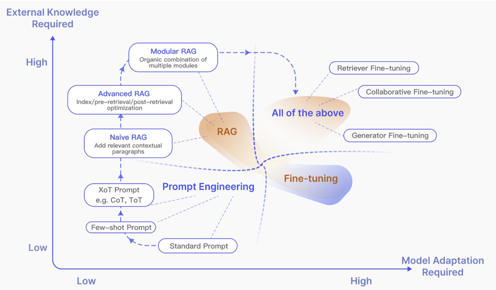
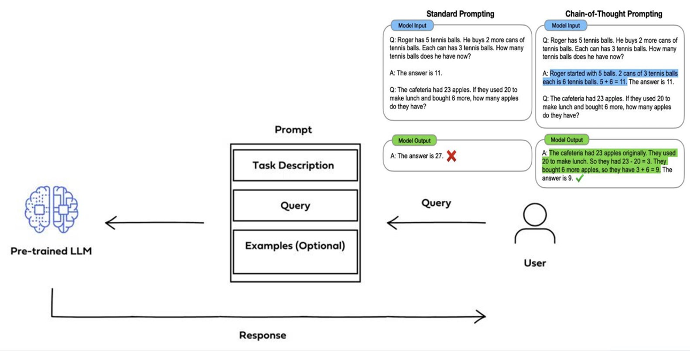
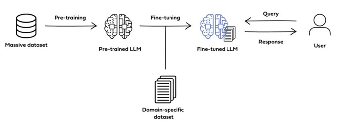
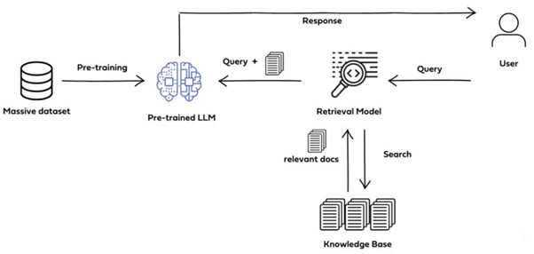
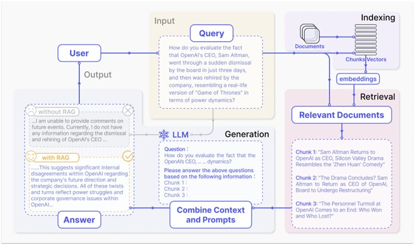
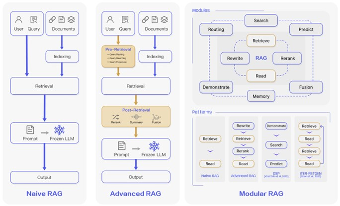
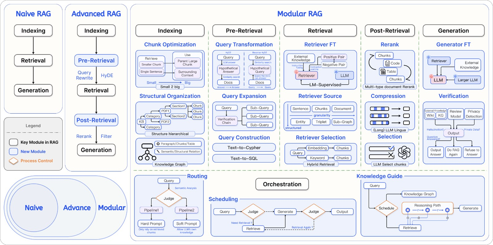
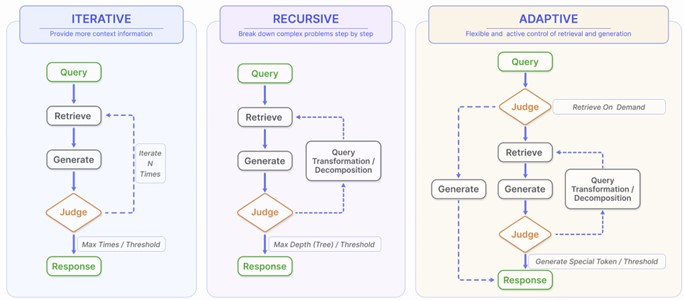
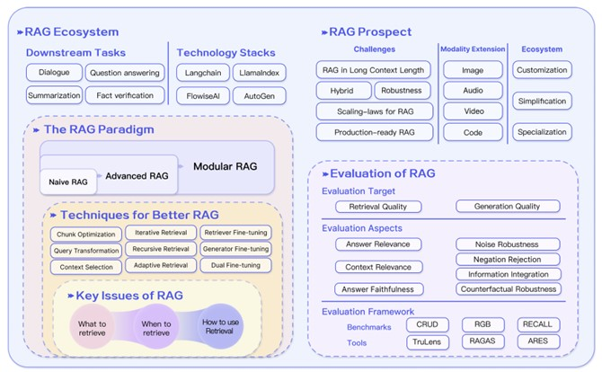

이번 포스트 시리즈의 주제는 'RAG'다. 기존에 SKT 혜택으로 'perplexity.ai'를 잘 쓰고 있었는데, 어쩌다 보니 RAG가 연구 주제로 잡혀서
문서 정리를 하게 되었고 그 중에서 중요한 부분을 기록해 두려 한다.

## Discriminative AI vs Generative AI

Discriminative AI:

+ 분류(Classification) 및 회귀(Regression) 등 전통적인 머신러닝 작업에 초점을 맞춤.

+ 일반적으로 고정된 스키마 입력. (입출력이 한정적임)

+ 특징: 지도 학습(Supervised Learning)

Generative AI: 

+ 대규모 데이터로 사전 학습된 모델을 통해 완전히 새로운 데이터를 생성하는 데 중점을 둔 기술.

+ 언어 생성, 이미지 생성 등 다양한 창의적 작업 가능. (입출력이 유연함)

+ 특징: 비지도학습(unsupervised) , 자가학습(self-supervised)

## What is LLM(Large Language Models)?

대규모 데이터셋을 활용하여 훈련된 언어 모델로, 인간의 언어를 이해하고 생성하는 데 최적화된 모델.

LLM의 특징: 

+ 대규모 학습 데이터:
    
    + 수백억~수조 개의 토큰으로 이루어진 데이터로 학습.
    
    + 웹 데이터, 논문, 소셜 미디어 등 광범위한 데이터 출처 활용.

+ Generative AI의 핵심:

    + 새로운 텍스트 생성, 질문 응답(QA), 요약, 번역 등 언어 생성 작업 수행.
    
    + 창의적이고 유연한 응답 가능.

+ 제로샷(Zero-shot) 추론 가능:

    + 추가 학습 없이도, 사전 학습된 지식을 활용해 새로운 작업을 수행.

    + 프롬프트만으로도 특정 도메인에서 문제 해결 가능.

+ 다양한 작업에서의 적용성:

    + 텍스트 분류, 감정 분석, 대화형 AI, 코드 생성, 의료 데이터 분석 등 다양한 도메인에서 활용.

LLM 한계: 

+ LLM 응답에 대한 예측 불가능.

+ LLM 훈련 데이터는 정적. 사용자가 구체적이고 최신의 응답을 기대할 때 오래되었거나 일반적인 정보를 제공.

+ 환각(Hallucination)
    
    + 답변이 없을 때 허위 정보 제공.
    
    + 신뢰할 수 없는 출처로부터 응답을 생성.

+ 추론 능력 부족.

    + LLM은 추론의 깊이가 부족하여 논리적이거나 복잡한 문제 해결에 한계가 있음.
    
    + LLM은 논리적 체계보다는 패턴 인식에 의존하기 때문.

+ 지식 매개변수화(parameterizing knowledge) 효율성이 낮음

    + LLM은 모든 지식을 모델의 가중치(parameter)에 압축 저장함.

    + 이는 지식을 업데이트하거나 확장하는 데 비효율적임(어려움)

## LLM의 한계를 극복하기 위한 방안

### Prompt Engineering

프롬프트 엔지니어링은 LLM의 성능을 개선하기 위해 입력 텍스트를 구조화하거나 재구성하는 과정. 이는 소프트웨어적 접근 방식으로, 모델의 가중치를 변경하지 않으면서도 성능을 크게 향상시킬 수 있음.

### Fine Tuning

사전 학습된 대규모 언어 모델(LLM)을 특정 도메인이나 작업에 맞게 다시 학습시키는 과정. 이를 통해 모델의 가중치(Weights)를 조정하여, 사전 학습된 일반적인 언어 이해 능력을 특정한 용도에 맞게 최적화.

### RAG(Retrieval-Augmented Generation)

대규모 언어 모델의 출력을 최적화하여 응답을 생성하기 전에 학습 데이터 소스 외부의 신뢰할 수 있는 지식 베이스를 참조하도록 하는 프로세스. RAG는 이미 강력한 LLM의 기능을 특정 도메인이나 조직의 내부 지식 기반으로 확장하므로 모델을 다시 교육할 필요가 없음. 

## RAG vs Fine-Tuning

|               |	**RAG**	                                      |**Fine-Tuning**                            |
|---|------                                    |------                                  |
|**Performance**	 |외부 지식에 의존하여 성능 향상	                 |모델 자체에 추가 교육을 통해 성능 향상      |
|**Knowledge Updates**|	검색 지식 기반을 직접 업데이트하면 자주 재교육할 필요 없이 정보가 최신 상태가 유지되므로 동적 데이터 환경에 매우 적합 | 지식 및 데이터 업데이트를 위해 재교육이 필요한 정적 데이터를 저장 |
|**External Knowledge**|외부 리소스를 활용하는데 능숙하며, 특히 문서나 기타 구조적/비구조적 데이터베이스에 엑세스하는 데 적합| 사전 학습을 통해 외부에서 얻은 지식을 대규모 언어 모델과 정렬하는 데 활용할 수 있지만, 자주 변경되는 데이터 소스의 경우에는 실용적이지 않을 수 있음.|
|**Data processing**|최소한의 데이터 처리(processing) 및 손질(handling)이 필요|고품질 데이터 세트 생성에 따라 달라지며, 제한된 데이터 세트로 인해 성능이 크게 향상되지 않을 수 있음.|
|**Model Customization**|정보 검색 및 외부 지식 통합에 중점을 두지만, 모델 행동이나 글쓰기 스타일을 완전히 맞춤화하지 못할 수도 있음|특정 톤이나 용어를 기반으로 LLM 동작, 작문 스타일 또는 특정 도메인 지식을 조정할 수 있음|
|**Interpretability**|응답은 특정 데이터 소스로 역추적될 수 있어 더 높은 해석 가능성과 추적 가능성을 제공|블랙박스와 마찬가지로 모델이 특정 방식으로 반응하는 이유가 항상 명확하지 않아 상대적으로 해석성이 떨어짐|
|**Computational Resources**|	데이터베이스와 관련된 검색 전략 및 기술을 지원하기 위해 컴퓨팅 리소스에 의존, 추가적으로 외부 데이터 소스 통합 및 업데이트에 대한 유지 관리가 필요|고품질 훈련 데이터 세트의 준비 및 큐레이션, 미세 조정 객체 정의, 해당 컴퓨팅 리소스 제공이 필요|
|**Latency Requirements**|	데이터 검색이 필요하므로 대기시간이 길어질 수 있음|	미세조정 후 LLM은 검색 없이 응답할 수 있으므로 대기 시간이 단축|
|**Reducing Hallucinations**|	각 답변은 검색 증거에 기반을 두고 있기 때문에 본질적으로 환각에 걸릴 가능성이 적음|	특정 도메인 데이터를 기반으로 모델을 훈련하면 환각을 줄이는데 도움이 될 수 있지만, 익숙하지 않은 입력에 직면하면 여전히 환각을 나타낼 수 있음|
|**Ethical and Privacy Issues**|외부 데이터 베이스에서 텍스트를 저장하고 검색할 때 윤리적 및 개인 정보 보호 문제가 발생|	훈련 데이터의 민감한 컨텐츠로 인해 윤리적 및 개인 정보 보호 문제가 발생할 수 있음|

## 타 방안 대비 RAG의 장점

RAG는 Prompt Engineer와 구현 복잡도, 구현 및 유지 비용이 비슷하며 Fine-tuning보다 이 점에서 유리함. 도메인 특화 용어에서는 Fine-Tuning 대비 성능이 떨어지나 환각, 최신 응답 제공, 투명성 및 해석 가능성에서 Prompt Engineering과 Fine-Tuning을 앞섬.

## Naive RAG

GPT 채택 이후 두각을 나타낸 초기 방법론

### 구성

Naive RAG는 가장 초기의 Retrieval-Augmented Generation(RAG) 패러다임으로, 간단한 "Retrieve-Read" 프레임워크를 따름. 

+ Indexing: 다양한 형식(PDF, HTML 등)의 원시 데이터를 정리하고 추출하여 텍스트로 변환. 텍스트를 작은 chunk로 분할하고, 임베딩 모델을 사용해 벡터로 변환한 뒤 벡터 데이터베이스에 저장.

+ Retrieval: 사용자 쿼리를 벡터로 변환하고, 데이터베이스 내 chunk와의 유사도를 계산하여 상위 k개의 관련 chunk를 검색.

+ Generation: 검색된 chunk와 사용자 질문을 결합한 프롬프트를 LLM에 입력하여 응답 생성.

### 한계

+ Retrieval Challenges: 검색 단계에서는 정밀도와 재현율에 어려움을 겪는 경우가 많아 잘못 정렬되거나 관련이 없는 chunk가 선택되고 중요한 정보가 누락됨.

+ Generation Difficulties: 모델이 환각(hallucination)을 일으켜 검색된 문맥에 기반하지 않은 내용을 생성하거나, 생성된 응답이 중복되거나 비일관적일 수 있음.

+ Augmentation Hurdles: 검색된 정보와 작업을 통합하는 데 어려움이 있으며, 중복된 정보로 인해 응답이 반복적이거나 비효율적일 수 있음.

## Advanced RAG

Advanced RAG는 Naive RAG의 한계를 극복하기 위해 고안된 개선된 패러다임으로, 검색 품질과 문맥 통합을 향상시키기 위한 추가 전략을 포함.

### Pre-Retrieval

+ 인덱싱 최적화: 슬라이딩 윈도우 방식, 세분화된 데이터 분할, 메타데이터 추가 등을 통해 인덱스 품질을 개선.

+ 쿼리 최적화: 질문을 명확하고 검색 작업에 적합하게 만들기 위해 쿼리 재작성(query rewriting), 확장(query expansion) 등의 기술 사용.

### Post-Retrieval

+ 재정렬(Re-ranking): 검색된 정보를 재정렬하여 가장 관련성 높은 콘텐츠를 강조.

+ 문맥 압축(Context Compression): LLM 입력 길이를 줄이고 핵심 정보를 강조하기 위해 불필요한 정보를 제거.

## Modular RAG

Modular RAG는 기존 Naive RAG와 Advanced RAG의 한계를 극복하고, 유연성과 적응성을 강화한 구조로 설계됨. 이 접근법은 다양한 작업과 시나리오에 맞게 모듈을 추가하거나 재구성할 수 있어, 특정 요구사항에 최적화된 성능을 제공. 

Modular RAG는 RAG 시스템을 여러 개의 독립적인 모듈로 나누어 구성하는 방식을 제안함. 이를 통해 각 모듈은 다른 모듈과 독립적으로 동작하면서도, 
서로 필요한 정보를 교환하며 전체 시스템을 구성할 수 있음. 핵심은 ‘모듈화’. 

크게 세 가지 주요 수준으로 나뉘어짐.

첫 번째, 모듈. RAG 시스템의 핵심 프로세스를 담당함. Ex: 데이터 인덱싱, 검색 전후 처리, 생성 과정.

두 번째, 하위 모듈. 각 모듈 내의 세부 기능을 세분화하고 최적화하는 역할을 함. Ex: 쿼리 확장, 검색기 선택.

세 번째, 연산자. 하위 모듈 내에서 실제 기능을 수행하는 기본 단위. Ex: 슬라이딩 윈도우, 메타데이터 첨부.

### New Modules

+ Search Module: 검색 엔진, 데이터베이스, 지식 그래프 등 다양한 데이터 소스를 직접 검색.

+ Memory Module: LLM의 메모리를 활용해 반복적 자기 강화(self-enhancement)를 통해 데이터 분포와 더 잘 맞는 텍스트 생성.

+ Routing Module: 쿼리에 따라 최적 경로를 선택해 요약, 특정 데이터베이스 검색, 정보 통합 등 다양한 작업 수행.

+ Predict Module: 중복성과 노이즈를 줄이고, 더욱 정확한 컨텍스트를 생성.

+ Task Adapter Module: 특정 작업에 맞춘 RAG를 자동화하고, zero-shot 입력에 적합한 프롬프트를 생성.

### New Patterns

모듈 교체 및 재구성을 통해 특정 문제 해결 가능. 기존의 "Retrieve-Read" 구조를 넘어선 상호작용 흐름 제공. 하이브리드 검색 전략(키워드, 의미적, 벡터 검색 통합) 도입.

## Retrieval

### Retrieval Source

#### Data Structure

+ Unstructured Data(Text): 가장 널리 쓰이는 source.

+ Semi-structured Data(PDF): 텍스트와 테이블 정보의 조합을 포함하는 데이터. 두 가지 문제점을 내포.

    + 텍스트 분할 중 실수로 테이블이 분리될 수 있음.
    
    + 테이블을 데이터에 포함하면 semantic similarity search가 복잡해짐.

+ Structured Data(knowledge graph): 구조화된 데이터베이스를 구축, 유효성 검사 및 유지 관리하기 위해 추가적인 노력이 필요.

+ LLMs-Generated content: RAG에서 외부 보조 정보의 한계를 해결하기 위해 일부 연구는 LLM의 내부 지식을 활용하는 데 초점을 맞춤.

#### Retrieval Granularity

+ Coarse-grained retrieval units: 세분화된 단위(예: 문장, 구문)는 정밀도를 높이지만 맥락을 잃을 위험이 있음.

+ Fine-grained retrieval units: 큰 단위(예: 문서)는 더 많은 정보를 제공하지만 불필요한 내용이 포함될 가능성이 큼.

In text, retrieval granularity ranges from fine to coarse, including Token, Phrase, Sentence, Proposition, Chunks, Document.

### Indexing Optimization

+ Chunking Strategy: 일반적으로 문서를 고정된 수의 토큰으로 Chunk를 분할함. 더 큰 chunk는 더 많은 맥락을 포착할 수 있지만 더 많은 노이즈를 생성하여 더 긴 처리 시간과 더 높은 비용이 필요합니다. 더 작은 chunk는 필요한 맥락을 완전히 전달하지 못할 수 있지만 노이즈는 적음. 슬라이딩 윈도우 또는 재귀적 분할 방식을 통해 문맥을 보존하면서 검색 성능 향상.

+ Metadata attachments: 페이지 번호, 파일명, 작성자 등 메타데이터를 추가하여 검색 범위를 제한하거나 시간 민감성을 반영.

+ Structural index: 계층적 구조나 지식 그래프를 활용해 문서 간의 논리적 관계를 유지하고 검색 정확도 향상.

### Query optimization

#### Query expansion

원래 질문을 여러 하위 질문으로 확장해 맥락을 풍부하게 하고 검색 정확도 향상.

+ Multi-Query

+ Sub-Query

+ Chain-of-Verification (CoV)

#### Query transformation

원래 질문을 재작성하거나 가설적인 답변(HyDE)을 생성해 검색 성능 개선.

+ Query rewrite: LLM을 통한 쿼리 재작성

+ 프롬프트 엔지니어링을 사용하여 LLM이 후속 검색을 위해 원래 쿼리를 기반으로 쿼리를 생성하도록 함.

#### Query routing: 쿼리의 키워드나 의미 정보를 활용해 적합한 RAG 파이프라인으로 라우팅.

+ Metadata Router/filter

+ Semantic Router

### Embedding

RAG에서 검색은 질문의 임베딩과 문서 chunk 사이의 유사도(예: 코사인 유사도)를 계산하여 달성되며, 임베딩 모델의 semantic representation capability이 핵심적인 역할을 함

+  Mix/hybrid retrieval: Sparse 및 Dense 임베딩 방식을 결합해 상호 보완적인 검색 성능 제공.

+ Fine-tuning Embedding Model: 의료, 법률 등 특수 도메인 데이터에 맞춰 임베딩 모델을 미세 조정하여 정확도 향상.

### Adapter

LLM(대규모 언어 모델)의 다중 작업 능력을 최적화하고, 제한된 자원 환경에서 효율성을 높이기 위해 도입된 외부 모듈

## Generation

검색 후, 검색된 모든 정보를 LLM에 직접 입력하여 질문에 답하는 것은 좋은 관행이 아님.

### Context Curation

중복된 정보는 LLM의 최종 생성을 방해할 수 있으며, 지나치게 긴 컨텍스트는 LLM을 "Lost in the Middle" 문제로 이끌 수도 있음. 따라서 RAG시스템에서는 일반적으로 검색된 콘텐츠를 추가로 처리해야 함.

+ Reranking: 검색된 문서 chunk를 재정렬하여 가장 관련성이 높은 정보를 우선적으로 배치. 규칙 기반(Relevance, Diversity 등) 또는 모델 기반(BERT, GPT 등) 방법을 사용하여 재정렬 수행.

+ Context selection/compression: 너무 많은 정보를 포함하면 노이즈가 증가하므로, 핵심 정보를 강조하고 불필요한 데이터를 제거. 소형 언어 모델(SLM)을 사용해 중요하지 않은 토큰을 제거하거나, 대형 언어 모델(LLM)을 통해 문맥 평가 및 필터링 수행.

+ 문서 수 축소: 검색된 문서의 수를 줄여 모델의 응답 정확성을 높임.

### LLM Fine-tuning

시나리오와 LLM의 데이터 특성에 기반한 타겟팅된 미세 조정은 더 나은 결과를 낼 수 있음.

## AUGMENTATION PROCESS IN RAG

이 단계는 검색된 정보를 보다 효과적으로 활용하여 복잡한 문제를 해결하고 응답의 품질을 개선하기 위해 설계되었습니다. 이는 단순히 한 번의 검색과 생성으로 끝나는 기존 방식의 한계를 극복하고, 다단계 추론 및 적응형 검색 전략을 도입하여 더 나은 결과를 제공합니다.

### Iterative Retrieval

초기 쿼리와 생성된 텍스트를 기반으로 지식 베이스를 반복적으로 검색하여 추가적인 맥락을 제공.

+ 장점: 각 단계에서 더 풍부하고 목표에 맞는 정보를 제공하여 응답 생성의 정확성과 견고성을 향상

+ 단점: 반복 과정에서 의미적 불연속성이나 불필요한 정보 축적이 발생할 수 있음. 

### Recursive Retrieval

사용자의 쿼리를 점진적으로 세분화하거나 재구성하여 세부적인 정보를 반복적으로 검색하는 방식

### Adaptive Retrieval

LLM이 스스로 외부 지식 검색의 필요성과 시점을 판단하는 방식

## Task and Evaluation

###  Downstream Task

RAG의 핵심 작업은 여전히 질의응답(QA)이며, 여기에는 전통적인 단일 홉/멀티 홉 QA, 객관식, 도메인별 QA 및 RAG에 적합한 장문 시나리오가 포함됨. 

### Evaluation Target

+ Retrieval quality: 검색된 문맥이 얼마나 정확하고 관련성이 높은지를 평가.

+ Generation quality: 생성된 응답의 일관성과 정확성을 평가.

### Evaluation Aspects

Context Relevance, Noise robustness은 검색 품질을 평가하는 데 중요한 반면 나머지는 생성 품질을 평가하는데 중요.

#### Quality Scores

품질 점수는 정보 검색 및 생성 프로세스에서 다양한 관점에서 RAG 모델의 효율성을 평가합니다Context Relevance: 검색된 문맥이 질문과 얼마나 관련성이 있는지 평가.

+ Answer faithfulness: 생성된 응답이 검색된 문맥과 일치하는지 확인.

+ Answer relevance: 질문에 적합한 답변인지 평가.

#### required abilities

+ Noise robustness: 불필요한 문서가 포함되었을 때 모델의 대응 능력.

+ Negative rejection: 적절한 정보가 없을 경우 응답을 거부하는 능력.

+ Information integration: 여러 문서에서 정보를 통합하여 복잡한 질문에 답변하는 능력.

+ Counterfactual robustness: 잘못된 정보를 무시하고 정확한 답변을 생성하는 능력.

Retrieval-Augmented Generation for Large Language Models: A Survey(2023)

https://arxiv.org/abs/2312.10997

위의 논문과 인터넷 소스를 요약하여 정리한 글이다. 

다음 포스트는 'GraphRAG'이다.