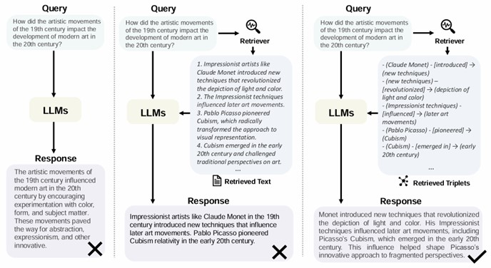
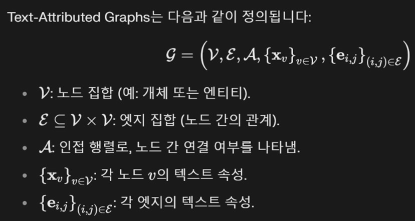
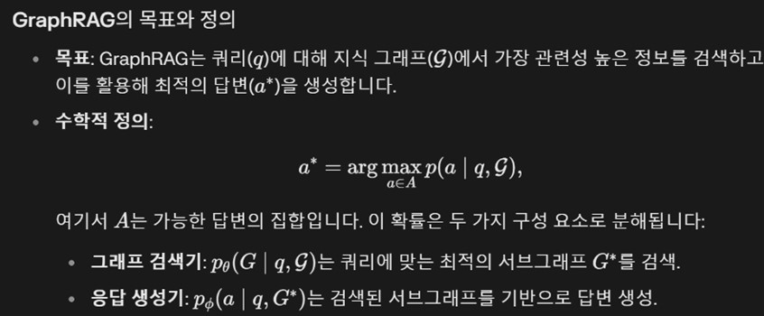
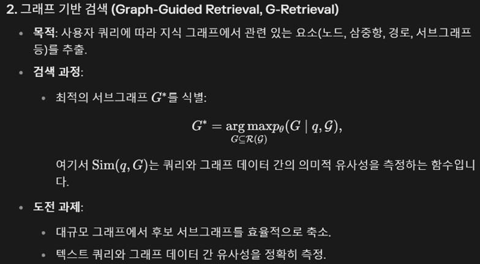
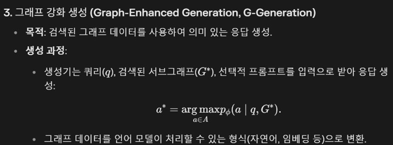
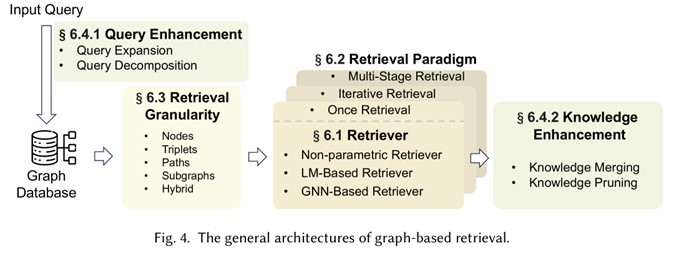
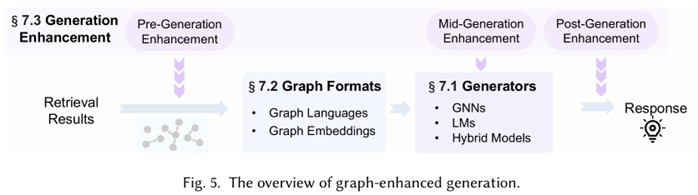
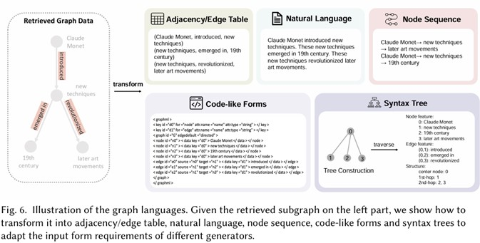

## GraphRAG의 등장

### RAG의 한계

+ Neglecting relationships: RAG는 텍스트 데이터를 독립적으로 처리하며, 데이터 간의 중요한 구조적 관계를 포착하지 못함.

+ Redundant information: RAG는 검색된 텍스트 스니펫을 프롬프트로 연결하여 사용할 때, 문맥이 지나치게 길어지거나 중복된 정보가 포함될 수 있음.

+ Lacking Global information: RAG는 문서의 일부만 검색하므로 전체적인 전역 정보를 포괄적으로 이해하지 못함.

### GraphRAG

기존 RAG와 달리 GraphRAG는 사전 구성된 그래프 데이터베이스에서 주어진 쿼리와 관련된 관계형 지식이 포함된 그래프 요소를 검색함. GraphRAG는 텍스트 간의 상호 연결을 고려하여 관계형 정보를 보다 정확하고 포괄적으로 검색할 수 있음

위 이미지는 Direct LLM, RAG, GraphRAG를 비교한다. 사용자 질의가 주어졌을 때, LLM이 직접 답변하면 피상적인 답변이나 구체성이 부족할 수 있습니다. RAG는 관련 텍스트 정보를 검색하여 문제를 다소 완화함으로써 이를 해결한다. 그러나 텍스트의 길이와 엔터티 관계에 대한 유연한 자연어 표현으로 인해 RAG는 질문의 핵심인 "영향" 관계를 강조하는 데 어려움을 겪는다. 반면 GraphRAG 방법은 그래프 데이터에서 명시적인 엔터티 및 관계 표현을 활용하여 관련 구조화된 정보를 검색하여 정확한 답변을 제공한다.

## 관련 기술과 GraphRAG 비교

### RAG

특징: 

+ 외부 지식을 LLM에 통합하여 작업 성능을 향상.

+ 텍스트 기반 데이터 검색에 초점.

GraphRAG의 차별점:

+ 텍스트 대신 그래프 데이터베이스에서 관계적 지식을 검색.

+ 조적 정보를 포함하여 더 정교하고 문맥적인 응답 생성.

### LLMs on Graphs

특징: 

+ GNN과 결합해 그래프 데이터 모델링 성능 향상.

+ 주로 노드 분류, 엣지 예측 등 그래프 작업에 초점.

GraphRAG의 차별점:

+ 그래프 데이터 검색과 생성에 초점.

+ 기존 연구는 그래프 모델링에 집중했으나, GraphRAG는 쿼리 기반 검색 및 활용을 강조.

### KBQA(Knowledge Base Question Answering)

특징

+ 지식 베이스를 기반으로 질문에 답변.

+ 정보 검색(IR) 기반 방법과 의미 해석(SP) 기반 방법으로 구분.

GraphRAG의 차별점

+ KBQA를 포함한 다양한 다운스트림 작업에 적용 가능.

+ 더 넓은 응용 범위와 기술적 확장성을 제공.

## Background knowledge of GraphRAG

### Text-attributed Graphs

Text-Attributed Graphs (TAGs)는 그래프 데이터의 한 유형으로, 그래프의 노드(node)와 엣지(edge)가 각각 텍스트 속성(textual attributes)을 포함하는 구조를 말함. 이는 GraphRAG(Graph Retrieval-Augmented Generation)에서 사용되는 일반적이고 보편적인 그래프 데이터 형식으로, 텍스트와 구조적 정보를 통합하여 복잡한 관계를 표현하고 활용할 수 있도록 설계되었음.

### Graph Neural Network(GNN)

그래프 데이터를 처리하고 분석하기 위한 딥러닝 모델. GNN은 그래프 구조를 활용하여 노드, 엣지, 그리고 전체 그래프의 표현(embedding)을 학습. GNN은 메시지 전달(message passing) 방식을 기반으로 작동함. 각 노드의 표현은 이웃 노드와 엣지로부터 정보를 집계(aggregation)하고 업데이트(update)하는 과정을 반복하여 학습됨.

## Overview of GraphRAG

## Graph-Based Indexing(G-indexing)

### Graph data

Open Knowledge graph: graph data sourced from publicly available repositories or databases

+ General Knowledge graph: 백과사전적 지식을 포함하며, 전 세계 커뮤니티의 입력과 업데이트를 통해 유지됨. 예: Wikidata, Freebase, DBpedia, YAGO. Commonsense Knowledge Graphs(general knowledge graph의 또다른 종류): 개념 간 의미적 연관성과 사건 간 인과 관계를 포함. 

+ Domain Knowledge graph: 특정 분야(예: 의학, 영화)에서 전문적인 지식을 제공. 

Self-constructed graph data: 특정 작업에 맞춰 문서, 테이블, 기타 데이터베이스 등 다양한 소스에서 생성된 그래프. 도메인별 요구 사항에 맞게 사용자 정의 가능. 

### Indexing(Graph-based indexing)

+ Graph indexing: 그래프 구조를 그대로 유지하며 노드와 엣지 간 연결성을 보존. 구조적 정보에 쉽게 접근 가능. BFS(너비 우선 탐색), 최단 경로 알고리즘 등 전통적인 검색 알고리즘 사용.

+ Text indexing: 그래프 데이터를 텍스트로 변환하여 검색 최적화. 텍스트 기반 검색 기술(희소/밀집 검색)을 활용 가능. 예: 삼중항(triplet)을 자연어 문장으로 변환하거나 서브그래프를 요약하여 텍스트로 저장.

+ Vector indexing: 그래프 데이터를 벡터 표현으로 변환하여 빠르고 효율적인 검색 지원. 임베딩을 활용해 유사성 기반 검색 수행. 

+ Hybrid indexing: 위 세 가지 방식을 결합하여 각 방식의 장점을 활용. 구조적 정보, 텍스트 콘텐츠, 효율성을 동시에 확보.

## Graph-Guided retrieval(G-retrieval)

그래프를 검색하는 데 중요한 두 가지 과제가 있음.

1. Explosive candidate subgraphs

2. Insufficient Similarity Measurement: 텍스트 쿼리와 그래프 데이터 간의 유사성을 정확하게 측정하려면 텍스트 및 구조적 정보를 모두 이해할 수 있는 알고리즘을 개발해야 함.

### Retriever(검색 모델)

+ Non-parametric Retriever: 전통적인 그래프 탐색 알고리즘(예: BFS, 최단 경로)을 사용하며, 학습 없이 높은 검색 효율성을 제공합니다.

+ LM-based Retriever: 강력한 자연어 이해 능력을 가진 언어 모델(예: RoBERTa, GPT)을 사용하여 텍스트 쿼리를 처리하고 관련 경로 또는 서브그래프를 검색.

+ GNN-based Retriever

+ During the retrieval process, non-parametric retrievers exhibit good retrieval efficiency, but they may suffer from inaccurate retrieval due to a lack of training on downstream tasks. Meanwhile, although LM-based retrievers and GNN-based retrievers offer higher retrieval accuracy, they require significant computational overhead. Considering this complementarity, many methods propose hybrid retrieval approaches to improve both retrieval efficiency and accuracy. Many approaches adopt a multi-stage retrieval strategy, employing different models at each stage.

### Retrieval paradigm

+ Once retrieval: 한 번의 작업으로 모든 관련 정보를 검색.

+ Iterative retrieval: 반복적 검색에서는 여러 검색 단계가 사용되며, 이후 검색은 이전 검색 결과에 따라 달라집니다. 이러한 방법은 연속적인 반복을 통해 검색된 정보의 이해 또는 완전성을 심화하는 것을 목표로 함.

    + Non-adaptive retrieval: 일반적으로 고정된 검색 순서를 따르며 검색 종료는 최대 시간 또는 임계값을 설정하여 결정됨.

    + Adaptive retrieval: 모델이 검색 활동을 완료하기 위한 최적의 순간을 자율적으로 결정하도록 하는 것

+ Multi-stage retrieval: 여러 단계를 거쳐 점진적으로 정교한 결과를 생성하며, 각 단계에서 다른 유형의 검색기를 사용할 수 있음.

+ once retrieval typically exhibits lower complexity and shorter response times, making it suitable for scenarios requiring real-time responsiveness. In contrast, iterative retrieval often involves higher time complexity, especially when employing LLMs as retrievers, potentially leading to longer processing times. However, this approach can yield higher retrieval accuracy by iteratively refining retrieved information and generating responses.

### Retrieval Granularity(검색 단위)

+ Nodes: 특정 엔티티나 요소만을 정확히 추출.

+ Triplet: 주체-관계-객체 형식으로 관계 데이터를 구조화하여 제공.

+ Path: 엔티티 간 관계 경로를 캡처하여 문맥 이해와 추론 지원.

+ Subgraph: 전체적인 관계 맥락을 포착하며 복잡한 패턴과 의존성을 분석 가능.

+ Hybrid Granularties: 노드, 삼중항, 경로, 서브그래프 등 다양한 단위를 결합하여 활용.

### Retrieval enhancement

+ Query enhancement 

    + Query Expansion: 원래 쿼리에 추가적인 관련 용어나 개념을 보강.

    + Query decomposition: 복잡한 쿼리를 더 작은 하위 쿼리로 나눠 처리.

+ Knowledge enhancement

    + Knowledge Merging: 여러 소스에서 얻은 정보를 통합해 일관성과 완전성 향상.
    
    + Knowledge Pruning: 덜 관련 있거나 중복된 정보를 제거해 결과 정제.

## Graph Enhanced Generation(G-generation)

검색된 그래프 데이터를 쿼리와 통합하여 응답 품질을 향상시키는 것이 목표. 이 단계에서는 다운스트림 작업에 따라 적합한 생성 모델을 선택. 그런 다음 검색된 그래프 데이터를 생성기와 호환되는 형식으로 변환함. 생성기는 쿼리와 변환된 그래프 데이터를 모두 입력으로 사용하여 최종 응답을 생성함. 

### Generator

The selection of generators often depends on the type of downstream task at hand.

+ GNN: 그래프 데이터를 직접 인코딩하여 구조적 관계와 노드 특징을 학습. 주로 판별 작업(Discriminative Tasks)에 적합하며, 예측 결과를 생성하기 위해 다층 퍼셉트론(MLP)을 활용함.

+ LM: LMs는 텍스트 이해 및 생성을 잘 수행하며, 그래프 데이터를 텍스트 형식으로 변환한 후 이를 입력으로 처리합니다. 판별 작업과 생성 작업 모두에 사용 가능.

+ hybrid model: GNN과 LM의 강점을 결합하여 그래프 구조와 텍스트 정보를 동시에 활용.
    
    + Cascaded paradigm(계단식): GNN이 그래프 데이터를 먼저 처리한 후 LM이 이를 기반으로 응답을 생성.
    
    + Parallel paradigm: GNN과 LM이 동시에 데이터를 처리하고 결과를 통합

### Graph format

GNN을 생성기로 사용할 때 그래프 데이터는 직접 인코딩할 수 있음. 그러나 LM을 생성기로 사용할 때 그래프 데이터의 비유클리드적 특성은 텍스트 데이터와 직접 결합하여 LM에 입력할 수 없기 때문에 문제가 됨. 이를 해결하기 위해 그래프 변환기를 사용하여 그래프 데이터를 LM과 호환되는 형식으로 변환. 이 변환은 구조화된 그래프 정보를 효과적으로 처리하고 활용할 수 있도록 하여 LM의 생성 기능을 향상시킴. 

+ Graph languages: 그래프 데이터를 특성화하고 표현하기 위해 특별히 제작된 공식화된 표기법 시스템

    + Adjacency/Edge table: 노드 간 연결을 나열하여 간결하게 표현.
    
    + Natural language: LMs가 이해할 수 있도록 그래프 데이터를 자연어로 설명

    + Code-like forms: 그래프 모델링 언어(GML), Graph Markup Language(GraphML) 등을 사용해 2D 구조를 표현.

    + Syntax tree: 그래프를 계층적 트리 구조로 변환하여 구조 정보를 보존.

    + Node sequence: 사전 정의된 규칙에 따라 노드와 경로를 시퀀스로 변환.

    + Good graph languages should be complete, concise, and comprehensible. 

        + Completeness entails capturing all essential information within the graph structure, ensuring no critical details are omitted. 
        
        + Conciseness refers to the necessity of keeping textual descriptions brief to avoid the “lost in the middle” phenomenon or exceeding the length limitations of LMs. 

        + Comprehensibility ensures that the language used is easily understood by LLMs, facilitating accurate representation of the graph’s structure.

+ Graph embeddings: GNN을 활용해 그래프 데이터를 벡터 표현으로 변환. 텍스트 표현과 통합하기 위해 동일한 의미 공간에서 표현. 긴 텍스트 입력 문제를 피할 수 있지만, 엔티티 이름과 같은 세부 정보를 보존하는 데 어려움이 있음.

### Generation enhancement

+ Pre-Generation enhancement: 입력 데이터나 표현을 개선하여 생성 품질을 높임.

+ Mid-Generation enhancement: 일반적으로 중간 결과 또는 맥락적 단서에 따라 생성 전략을 조정

+ Post-Generation enhancement: 여러 응답을 통합하거나 점수를 매겨 최종 응답 선택.

## Training 

### Training Strategies of Retriever

+ Training free: 별도의 학습 없이 사전 정의된 규칙이나 사전 학습된 모델을 활용하여 검색 작업을 수행.

    + 비학습형 검색기(Non-Parametric Retrievers): BFS(너비 우선 탐색)와 같은 전통적인 그래프 탐색 알고리즘 사용.
    
    + 사전 학습된 언어 모델(Pre-Trained LMs): 쿼리와 그래프 요소 간 유사성을 계산하여 적합한 그래프 요소를 선택.
	
    + 장점: 추가적인 학습 비용이 들지 않으며 간단히 구현 가능.

    + 단점: 특정 작업에 최적화되지 않아 성능이 제한될 수 있음.

+ Training based: Training-Based 접근법은 GraphRAG 검색기의 성능을 향상시키기 위해 다양한 지도 신호(간접 지도, 암묵적 신호, 자기 지도)를 활용함. 이러한 방법은 데이터 부족 문제를 해결하고, 노이즈를 줄이며, 복잡한 그래프 구조에서 더 정확한 정보를 검색할 수 있도록 도움.

### Training of Generator

+ Training free: 주로 폐쇄형 소스 LLM 또는 높은 훈련 비용을 피하는 것이 필수적인 시나리오에 적합.

+ Training based: 다운스트림 작업에서 감독 신호를 직접 수신할 수 있음.

### Joint training

+ Unified Models: 검색기와 생성기를 하나의 모델(주로 LLM)로 통합하여 동시에 학습.

+ Alternating Training: 초기에는 검색기와 생성기를 개별적으로 훈련한 후, 두 구성 요소를 번갈아가며 공동으로 미세 조정.

## Application: Downstream tasks

+ Question Answering(QA)

    + KBQA: 지식 그래프를 기반으로 질문에 답변하며, 엔터티 및 관계 추론이 필요.

    + CSQA(commonsense QA): 상식 지식 그래프를 활용하여 다중 선택형 질문에 답변.

+ Information Retrieval

    + Entity Linking(EL): 텍스트에서 언급된 엔터티를 지식 그래프의 해당 엔터티와 연결.
    
    + Relation extraction(RE): 텍스트 내 엔터티 간의 관계를 식별하고 분류.

+ Others

    + Fact verification

    + Link prediction: 그래프 내에서 누락된 관계나 연결을 예측.

    + Dialogue systems

    + Recommendation

참고자료: 

Graph Retrieval-Augmented Generation: A Survey

https://www.arxiv.org/pdf/2408.08921
